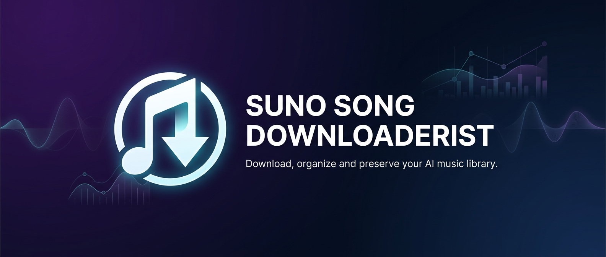

<p align="center">
  
</p>

<h1 align="center">Suno Song Downloaderist</h1>

<p align="center">
  <strong>Download, organize, and preserve your entire Suno AI music library.</strong>
</p>

<p align="center">
  
  
  
  
</p>

---

## 🤔 What Is This?

Have hundreds — or thousands — of songs on [Suno](https://suno.com)? Want to download them **all** with their lyrics, style prompts, cover art, and metadata in one go?

**Suno Song Downloaderist** does exactly that. It downloads your entire Suno library in minutes, not hours, and organizes everything into neat folders with all the data you'd ever want preserved.

- ✅ **No technical skills required** — follow the steps below and you're set
- ✅ **Your password is never stored** — you log in through your own browser
- ✅ **Respects Suno's servers** — built-in rate limiting so your account stays safe
- ✅ **Free and open source** — MIT licensed, forever

---

## ✨ Features

| Feature | Description |
|---------|-------------|
| 🎵 **Multiple Formats** | Download MP3, WAV (Pro/Premier), and MP4 video |
| 📝 **Full Metadata** | Lyrics, style/genre prompts, tags, model version, play count |
| 📁 **Auto-Organized** | Each song gets its own folder with all files inside |
| ⚡ **Fast** | Parallel downloads — 2,000 songs in approximately 15 minutes |
| 🏷️ **ID3 Tags** | MP3s get proper metadata tags + embedded cover art |
| 🎤 **Synced Lyrics** | `.lrc` files with timestamped lyrics for media player sync |
| 🖼️ **Cover Art** | High-resolution album art saved with each song |
| 🔄 **Resume Support** | Interrupted? Run it again — it picks up where it left off |
| 🎯 **Smart Filtering** | Download by date (with hour/minute precision), likes, play count |
| 📊 **Web Dashboard** | Beautiful local dashboard for visual download management |
| 🔐 **Secure** | Login via your browser, encrypted session storage |
| 🔀 **Version Grouping** | Same-title songs grouped together with version numbering |

---

## 🚀 Quick Start

### Step 1: Check if Python is installed

Open your **Terminal** (Mac/Linux) or **PowerShell** (Windows) and type:

```bash
python --version
```

You should see something like `Python 3.10.x` or higher. If you get an error or the version is below 3.10:

- **Download Python** from [python.org/downloads](https://www.python.org/downloads/)
- During installation on Windows, **check the box that says "Add Python to PATH"** — this is important!
- After installing, close and reopen your terminal, then try `python --version` again

### Step 2: Install Suno Song Downloaderist

```bash
pip install suno-song-downloaderist
```

**Or**, if you want to install from source (for contributing or development):

```bash
git clone https://github.com/chchchadzilla/suno-song-downloaderist.git
cd suno-song-downloaderist
pip install -e .
```

### Step 3: Install the browser for login

This tool opens a real browser window so you can log into Suno safely. Run this once:

```bash
playwright install chromium
```

> **What does this do?** It downloads a small copy of the Chromium browser that the tool uses *only* for login. Your actual Chrome browser is not affected.

### Step 4: Log in to Suno

```bash
suno-dl login
```

A browser window will open to [suno.com](https://suno.com). **Log in like you normally would** — Google, Apple, email, whatever you use.

Once you're logged in, the tool captures your session automatically and the browser closes. **Your password is never stored** — only an encrypted session token that expires after 7 days.

### Step 5: Download your songs!

```bash
suno-dl download
```

That's it! Your songs will be downloaded to `~/Music/SunoDownloaderist/` with all metadata, lyrics, and cover art.

### Step 6: Check your files

Navigate to your Music folder. You'll find something like this:

```
~/Music/SunoDownloaderist/
├── Neon Horizons/
│   ├── Neon Horizons.mp3          ← The song
│   ├── Neon Horizons.mp4          ← The video (if enabled)
│   ├── Neon Horizons.txt          ← Lyrics, prompt, metadata
│   ├── Neon Horizons.lrc          ← Synced lyrics for media players
│   ├── Neon Horizons.json         ← Raw metadata (for power users)
│   └── Neon Horizons_cover.png    ← Album cover art
├── Midnight Drive/
│   ├── Midnight Drive.mp3
│   ├── Midnight Drive.txt
│   ├── Midnight Drive_v2.mp3      ← Second version (same title)
│   ├── Midnight Drive_v2.txt
│   └── ...
└── ...
```

---

## 📋 Download Options

### Format Selection

```bash
# Download only MP3 (default)
suno-dl download

# Download MP3 + MP4 video
suno-dl download -f mp3 -f mp4

# Download everything (MP3 + WAV + MP4)
suno-dl download -f all

# Download WAV only (requires Pro/Premier subscription)
suno-dl download -f wav
```

> **Note:** WAV downloads require a Suno Pro or Premier subscription. The tool auto-detects your tier — if you're on the free plan, WAV will be automatically skipped with a friendly message.

### Filtering

```bash
# Only download songs you've liked/thumbs-upped
suno-dl download --liked-only

# Download songs from August 2026
suno-dl download --since "2026-08-01" --until "2026-08-31"

# Filter with hour and minute precision
suno-dl download --since "2026-08-15 14:30" --until "2026-08-15 18:00"

# Only songs with 10+ plays
suno-dl download --min-plays 10

# Search by title
suno-dl download --search "love song"

# Combine any filters
suno-dl download --liked-only --since "2026-07-01" -f all
```

### Other Options

| Flag | Short | Description | Default |
|------|-------|-------------|---------|
| `--output PATH` | `-o` | Where to save files | `~/Music/SunoDownloaderist/` |
| `--format FMT` | `-f` | Download format (mp3/wav/mp4/all) | `mp3` |
| `--workers N` | `-w` | Parallel downloads (1-8) | `3` |
| `--liked-only` | | Only liked songs | Off |
| `--since DATE` | | Songs created after date | All time |
| `--until DATE` | | Songs created before date | Now |
| `--search TEXT` | | Filter by title | None |
| `--min-plays N` | | Minimum play count | 0 |
| `--include-video` | | Also download MP4 | Off |
| `--skip-existing` | | Skip already downloaded | On |
| `--dry-run` | | Preview without downloading | Off |
| `--yes` | `-y` | Skip confirmation prompt | Off |
| `--verbose` | `-v` | Show detailed debug output | Off |

---

## 📊 Web Dashboard

For a visual experience, launch the web dashboard:

```bash
suno-dl dashboard
```

This opens a sleek local web page in your browser where you can:

- 🔍 Browse and filter your song library
- ✅ Select which formats to download (with WAV grayed out for free-tier users)
- 📈 Watch real-time download progress
- ⏸️ Pause, resume, or cancel downloads
- ⚙️ Configure all settings visually

The dashboard runs **locally on your computer** — nothing is sent to any external server.

---

## 📝 What's in the Metadata File?

Each `.txt` file contains everything about the song:

```
Title: Neon Horizons
Artist: YourDisplayName (via Suno AI)
Duration: 3:02
Created: 2026-08-15 12:34 UTC
Model: chirp-v4
Suno URL: https://suno.com/song/3a8b29c4-...
Play Count: 42
Liked: Yes

=== STYLE / GENRE PROMPT ===
80s synthwave, retro synth leads, nostalgic, driving bassline, female vocals

=== TAGS ===
synthwave, 80s, electronic, retro, upbeat, female vocalist

=== LYRICS ===
[Verse 1]
Driving through the neon glow
The city lights begin to flow
...

=== GENERATION INFO ===
Type: gen
Clip ID: 3a8b29c4-72e1-4c12-9b23-abcdef123456
Extended from: (none)
Concat history: (none)
```

---

## 🔧 Other Commands

```bash
# List all songs without downloading
suno-dl list

# List with filters
suno-dl list --liked-only --since "2026-08-01"

# Show details about a specific song
suno-dl info <clip-id>

# View current config
suno-dl config show

# Change a setting
suno-dl config set output_dir ~/Desktop/MySunoMusic
suno-dl config set workers 5

# Reset config to defaults
suno-dl config reset

# Log out (clear saved session)
suno-dl logout
```

---

## ❓ FAQ

### Is this safe? Will my account get banned?

**Yes, it's safe.** This tool:
- Never stores your password — you log in through a real browser
- Uses Suno's own APIs the same way their website does
- Includes built-in rate limiting to stay within acceptable request rates
- Downloads from their public CDN (the same place your browser downloads from)

### Does this work on Mac / Linux / Windows?

**Yes!** It works on all three. Python and Playwright are cross-platform.

### What if my download gets interrupted?

Just run `suno-dl download` again. The `--skip-existing` flag is on by default, so it will pick up where it left off without re-downloading anything.

### Can I download just specific songs?

Yes! Use the `--search` flag to filter by title, `--liked-only` for favorited songs, or `--since`/`--until` for date ranges (with hour and minute precision).

### Why can't I download WAV files?

WAV (lossless audio) downloads require a Suno Pro or Premier subscription. The tool auto-detects your subscription and will skip WAV if you're on the free tier.

### How long does it take to download everything?

Roughly **15 minutes for 2,000 songs** (MP3 only). Including MP4 videos doubles that. The actual speed depends on your internet connection and Suno's server load.

### I'm getting rate limited / errors. What do I do?

The tool handles this automatically with exponential backoff. If you're seeing persistent errors:
1. Try reducing workers: `suno-dl download --workers 1`
2. Your session may have expired: `suno-dl login` to refresh
3. Suno might be under heavy load — try again later

### Can I run this on a schedule?

Not built-in yet, but you can use your OS task scheduler (Windows Task Scheduler, cron on Linux/Mac) to run `suno-dl download --yes` periodically. The skip-existing feature means it will only download new songs.

---

## 🛠️ Development

### Setup

```bash
git clone https://github.com/chchchadzilla/suno-song-downloaderist.git
cd suno-song-downloaderist
pip install -e ".[dev]"
playwright install chromium
```

### Running Tests

```bash
pytest
```

### Linting & Type Checking

```bash
ruff check src/
mypy src/
```

---

## 🤝 Contributing

We'd love your help! Here's how:

1. **Fork** this repository
2. **Create a branch** for your feature: `git checkout -b feature/my-cool-feature`
3. **Make your changes** and write tests
4. **Run the tests**: `pytest`
5. **Submit a Pull Request**

Whether it's a bug fix, new feature, documentation improvement, or even a typo — all contributions are welcome.

---

## 📜 License

MIT License — do whatever you want with it. See [LICENSE](LICENSE) for details.

---

## 🙏 Credits

Built with love by [chchchadzilla](https://github.com/chchchadzilla) and AI.

**Open source libraries we use:**
- [Playwright](https://playwright.dev/) — Browser automation for secure login
- [httpx](https://www.python-httpx.org/) — Modern async HTTP client
- [Click](https://click.palletsprojects.com/) — Beautiful command-line interfaces
- [Rich](https://rich.readthedocs.io/) — Gorgeous terminal output
- [FastAPI](https://fastapi.tiangolo.com/) — Lightning-fast web dashboard
- [Pydantic](https://docs.pydantic.dev/) — Data validation
- [Mutagen](https://mutagen.readthedocs.io/) — Audio metadata / ID3 tags

---

<p align="center">
  <i>Made for the Suno community. If this tool helps you, give it a ⭐ on GitHub!</i>
</p>
